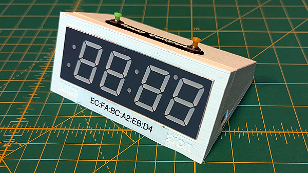

# Slattocks Junction Signalman
A control system for the display lights on the MMRS Slattocks Junction P4 model railway layout
## The Driver Unit

## The Driver Unit - Mk2

## The Driver Unit - Mk3
 

## The Driver Unit - Mk4
This could be inline  with a bit of luck
