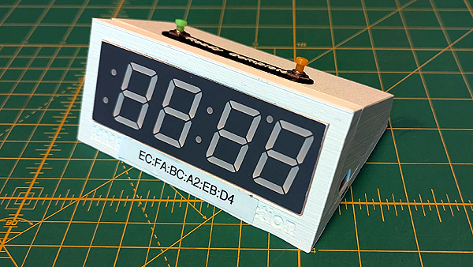

# Slattocks Junction Signalman
_A communication system for the signalman (dispatcher) and engine drivers on the MMRS Slattocks Junction P4 model railway layout._
Slattocks Junction is normally operated by a schedule of movements of trains from the fiddle yard and around the layout. The movements
are numbered with UP movements (anticlockwise) having odd numbers and DOWN movements (clockwise) having even numbers. The signalman send signals to 
the engine drivers as required but the odd numbered instructions appear only on UP driver's display and even numbered movements only on the DOWN
driver's display.
## The Driver Unit

